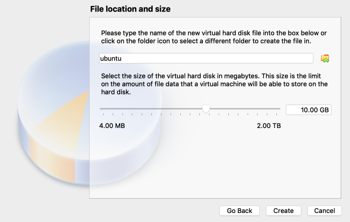
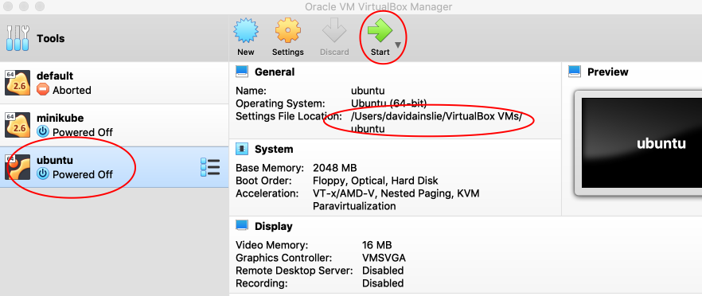
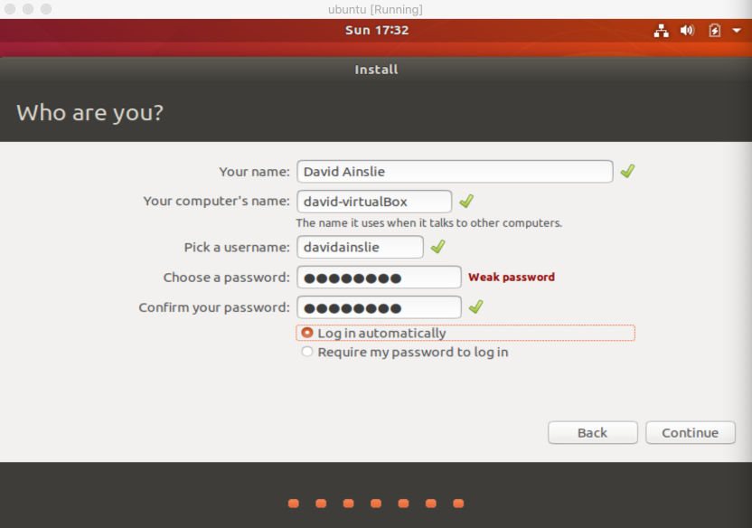

# VM Installation

We shall set up a VM using Ubuntu. At the time of writing, we downloaded [Ubuntu 18.04.2 LTS](https://www.ubuntu.com/download/desktop) which corresponds to **ubuntu-18.04.2-desktop-amd64.iso**.

Setup up a VM with Virtualbox. Upon opening Virtualbox:


---


---


---


---


---


---



It would be a good idea to share this project's **src** with our **virtual machine** (as we'll use this later):


---


---


Start our VM using the Ubuntu image we downloaded:



---


---


---


---


---


---



For this (noddy) VM setup, we don't actually care about security, so I went for a weak password of **password** and automatic login.


```bash
$ sudo apt-get update

$ sudo apt-get install build-essential gcc make perl dkms

$ reboot
```

Now, select **Devices** from VM menu and **Insert Guest Additions CD image...**


```bash
$ sudo adduser davidainslie vboxsf
Adding user davidainslie to group vboxsf
```

Reboot the VM. Using **Files** app, navigate to **computer > media > davidainslie**